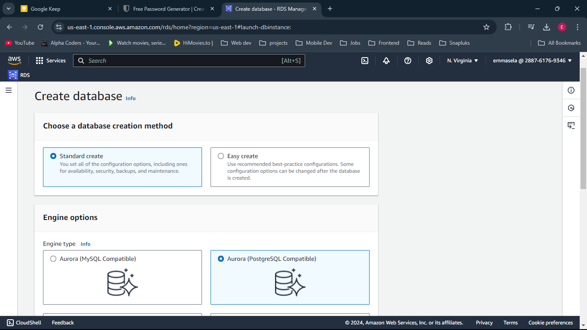
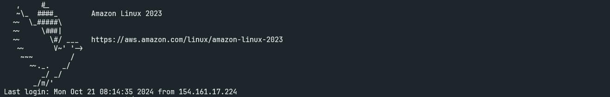
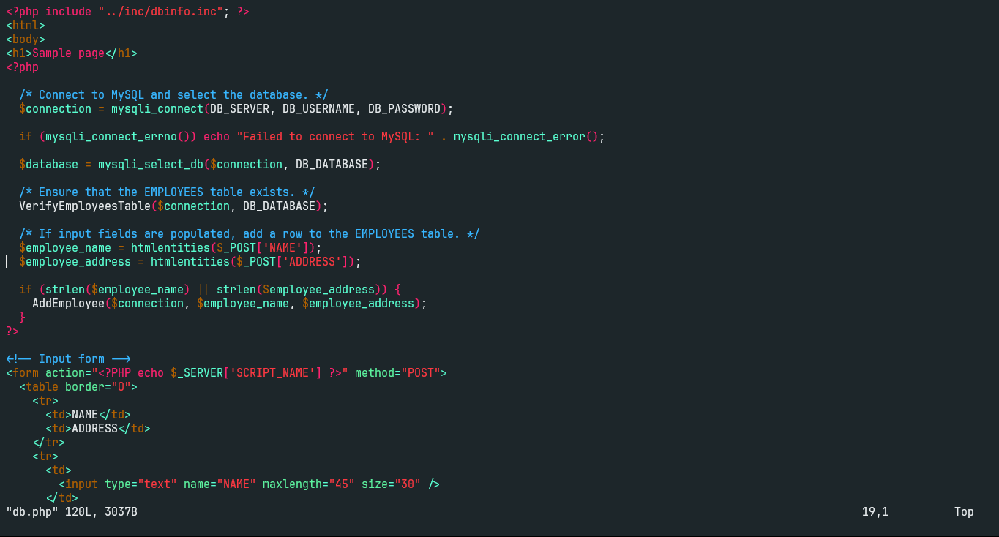
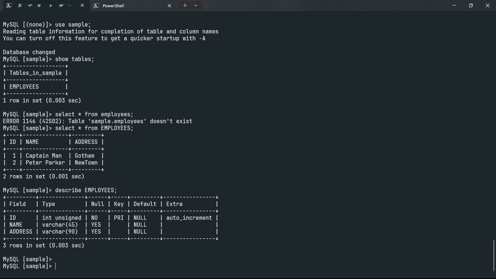
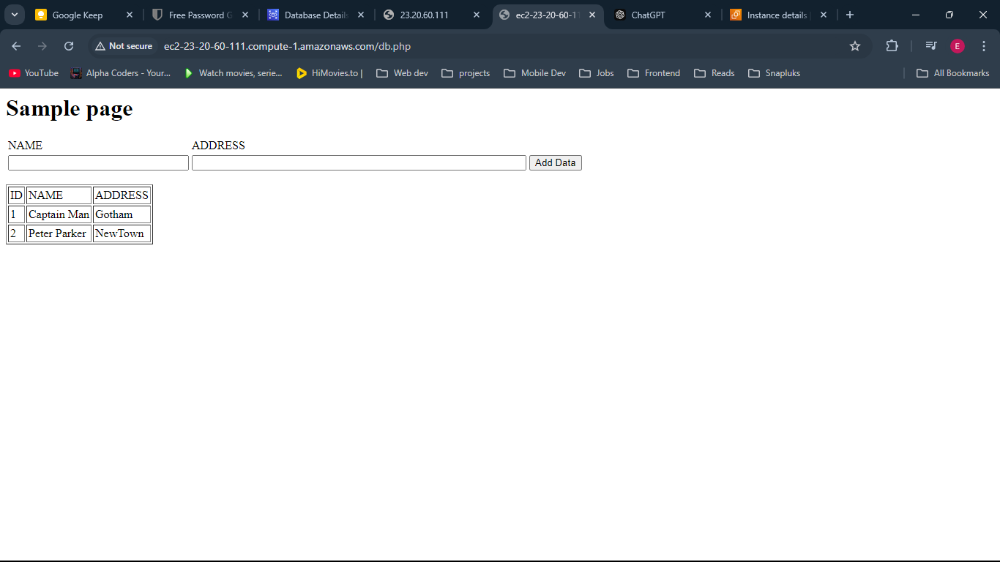

# 🚀 Web App with Amazon Aurora & EC2

Welcome to my cloud computing project repository! This project demonstrates the creation of a web application connected to a relational database using AWS services. It's a practical exploration of fundamental cloud concepts and AWS infrastructure.

## 📋 Project Overview

This repository contains images and documentation for a project that involves:

- Setting up an EC2 instance
- Configuring an Aurora RDS instance for MySQL
- Developing a simple web app that interacts with the database

## 🛠️ Technologies Used

- Amazon EC2
- Amazon Aurora (RDS)
- Apache Web Server
- MariaDB
- PHP
- IAM (Identity and Access Management)

## 🖼️ Project Images

This repository contains images documenting various stages of the project. Here's what you'll find:

## Aurora RDS Setup

## Establishing SSH Connection

## Web Application Code Snippet

## Database Interaction

## Running Web Application

## 🌟 Key Features

- Secure access management using IAM
- Scalable compute with EC2
- Reliable and performant database with Aurora RDS
- Simple web interface for data input and storage

## 📚 Lessons Learned

This project provided hands-on experience with:

1. AWS service integration
2. Database connection from a web application
3. Basic cloud security practices
4. Web server configuration in a cloud environment

## 🚀 Areas For Improvement

- Implement infrastructure as code (e.g., AWS CloudFormation)
- Add monitoring and logging with CloudWatch
- Set up auto-scaling for EC2
- Implement multi-AZ deployment for increased reliability
- Utilize Amazon CloudFront for content delivery

Happy Cloud Computing! ☁️💻

